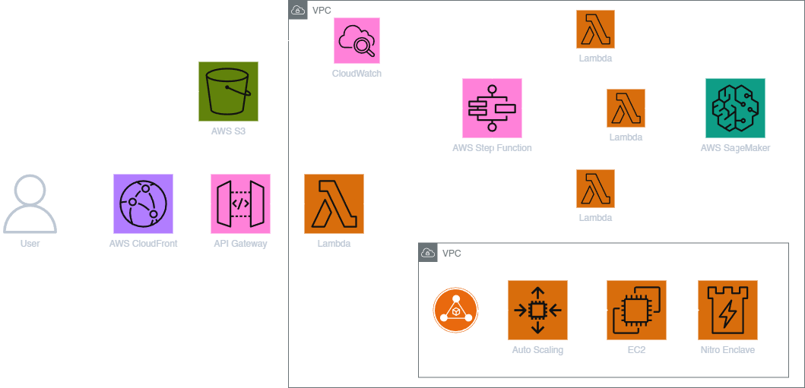

# Layer8 - Secure AI Interaction Platform

## Overview

Layer8 is a comprehensive privacy-first platform designed to protect sensitive data when interacting with AI systems. By providing advanced anonymization, encryption, and secure processing capabilities, Layer8 ensures that your data remains private while still leveraging the full power of AI.

## 🛡️ Core Features

- **Data Anonymization & De-anonymization**: Automatically identify and mask sensitive information before sending to AI models
- **Chrome Extension**: Locally encrypt data before sending to AI platforms and decrypt responses
- **Local LLM Deployment**: Self-hosted AI models via Docker for completely private processing
- **Secure Cloud Processing**: SGX enclave protection for sensitive data when using cloud services
- **Semantic Analysis**: Advanced NLP to detect and protect sensitive entities and patterns
- **RAG System**: Private retrieval-augmented generation for data analysis without exposing information
- **User-Friendly Interface**: Clean, modern UI for easy interaction with secure AI tools

## 🧩 Project Architecture Diagram



## 🏗️ Project Structure

Layer8 consists of four main components:

### API Service
Backend services for data anonymization, LLM integration, and processing:
```
api/
├── main.py                  # Main API controller
├── llm_integration.py       # LLM provider integration
├── prompt_generator.py      # System/user prompt generation
├── config.json              # Configuration file
├── nlp_data_anonymizer/     # Core anonymization package
└── api_service/             # API server components
```

### Frontend
User interface built with Svelte:
```
frontend/
├── src/                     # Source files
│   ├── routes/              # Application routes
│   ├── lib/                 # Shared components and utilities
│   └── assets/              # Static assets
├── static/                  # Public static files
└── package.json             # Dependencies and scripts
```

### Chrome Extension
Browser extension for encrypting data sent to AI platforms:
```
extension/
├── manifest.json            # Extension configuration
├── popup.html               # Extension popup interface
├── popup.js                 # Popup functionality
├── content.js               # Content script for page integration
├── background.js            # Background service worker
└── images/                  # Extension icons and images
```

### RAG System
Retrieval-augmented generation for private data analysis:
```
RAG/
├── app.py                   # RAG server application
├── test_api.py              # API testing utilities
└── requirements.txt         # Python dependencies
```

## 🚀 Getting Started

### Quick Start with Docker

The fastest way to get started with Layer8 is using our Docker image:

```bash
# Pull the image
docker pull vickydev810/layer8:latest

# Create required volumes for data persistence
docker volume create ollama
docker volume create open-webui

# Run the container
docker run -d -p 3000:8080 --gpus=all \
  -v ollama:/root/.ollama \
  -v open-webui:/app/backend/data \
  --name open-webui \
  --restart always \
  vickydev810/layer8:latest
```

Once running, access the Web UI at http://localhost:3000

### Manual Installation

#### API Service Setup

1. Navigate to the API directory:
   ```bash
   cd api
   ```

2. Create a virtual environment:
   ```bash
   python -m venv venv
   source venv/bin/activate  # On Windows: venv\Scripts\activate
   ```

3. Install dependencies:
   ```bash
   pip install -r requirements.txt
   ```

4. Install required NLP model:
   ```bash
   python -m spacy download en_core_web_lg
   ```

5. Copy the example environment file and configure your API keys:
   ```bash
   cp .env.example .env
   # Edit .env with your API keys
   ```

6. Run the API server:
   ```bash
   python main.py
   ```

#### Frontend Setup

1. Navigate to the frontend directory:
   ```bash
   cd frontend
   ```

2. Install dependencies:
   ```bash
   npm install
   ```

3. Start the development server:
   ```bash
   npm run dev
   ```

4. Build for production:
   ```bash
   npm run build
   ```

#### Chrome Extension Setup

1. Open Chrome and navigate to `chrome://extensions/`
2. Enable "Developer mode"
3. Click "Load unpacked" and select the `extension` directory
4. The extension icon should appear in your browser toolbar

#### RAG System Setup

1. Navigate to the RAG directory:
   ```bash
   cd RAG
   ```

2. Create a virtual environment:
   ```bash
   python -m venv venv
   source venv/bin/activate  # On Windows: venv\Scripts\activate
   ```

3. Install dependencies:
   ```bash
   pip install -r requirements.txt
   ```

4. Configure environment variables:
   ```bash
   cp .env.example .env
   # Edit .env with your API keys
   ```

5. Run the RAG server:
   ```bash
   python app.py
   ```

## 💻 Usage Examples

### CLI Data Anonymization

```bash
cd api
python main.py --interactive
```

When prompted, enter your query containing sensitive information. The system will:
1. Detect and mask sensitive entities
2. Send the anonymized query to the LLM
3. De-anonymize the response

### Browser Extension

1. Navigate to any AI service (ChatGPT, Gemini, Grok)
2. Type your message in the input field
3. Click the "Encrypt" button before sending
4. Your message will be encrypted before transmission
5. Responses will be automatically decrypted

### Data Analysis with RAG

1. Start the RAG server 
2. Upload your CSV or PDF file
3. Ask natural language questions about your data
4. Receive analyzed results without exposing sensitive information

## 🔒 Privacy Architecture

Layer8 implements several layers of protection:

1. **Local Processing**: Primary data anonymization happens on your local device
2. **Edge Computing**: Process sensitive data at the edge using local LLMs
3. **Secure Enclaves**: When using cloud services, data is protected in SGX enclaves
4. **Homomorphic Encryption**: (Future) Perform computations on encrypted data

## 🛠️ Technologies Used

- **Backend**: Python, Flask, spaCy, PyTorch
- **Frontend**: Svelte, TypeScript, TailwindCSS
- **Extension**: JavaScript, Chrome Extensions API
- **Security**: Intel SGX, Secure Enclaves, Encryption Libraries
- **AI Models**: Support for OpenAI, Anthropic, Google Gemini, and local models

## 🔍 Advanced Configuration

### Custom Entity Detection

Edit `api/config.json` to add domain-specific sensitive terms:

```json
"domain_specific_terms": {
  "project": ["Project Alpha", "Operation Phoenix"],
  "product": ["SecretProduct X9"],
  "internal_code": ["XZ-1234", "ACME-7890"]
}
```

### Choosing LLM Providers

Configure which LLM provider to use in `api/config.json`:

```json
"llm": {
  "provider": "openai",  // Options: "openai", "anthropic", "gemini", "local"
  "model": "gpt-4o",
  "temperature": 0.7,
  "max_tokens": 1000
}
```

## 🔮 Future Roadmap

- **Homomorphic Encryption**: Perform AI operations on encrypted data
- **Multi-user Support**: Team-based access controls and sharing
- **Custom Fine-tuning**: Create private models tuned to your specific needs
- **Federated Learning**: Train models across distributed datasets without sharing data
- **Audit Trails**: Comprehensive logging of all AI interactions for compliance

## 📄 License

This project is licensed under the MIT License - see the LICENSE file for details.

## 🤝 Contributing

Contributions are welcome! Please feel free to submit a Pull Request.

## 📞 Support

For questions, issues or feature requests, please open an issue on GitHub or contact the development team.

---

<p align="center">
  <em>Secure your data. Empower your AI.</em><br>
  Layer8 - Where privacy meets intelligence
</p> 
